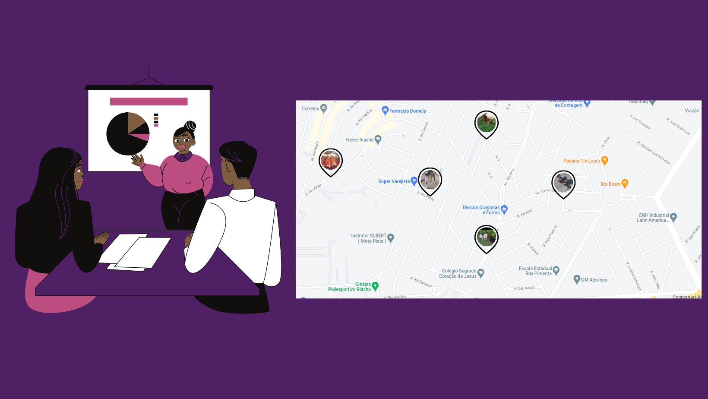
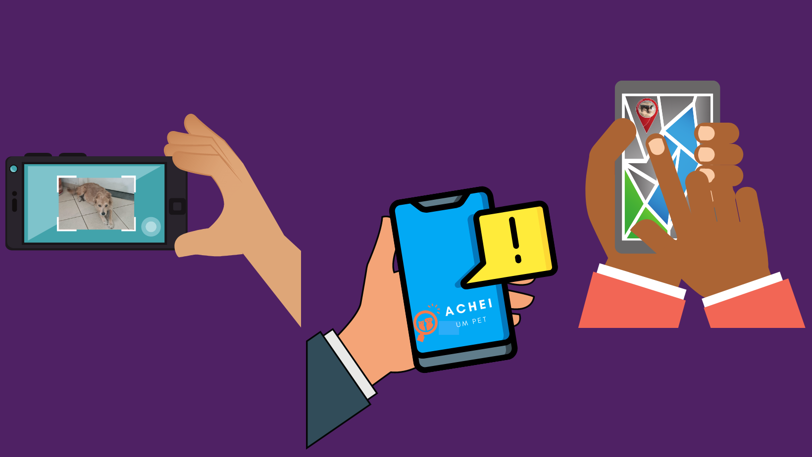

  <a>
    <a href="https://achei-um-pet-service.herokuapp.com/">
    <a href="https://www.mongodb.com/cloud/atlas">
    

<h1 align="center">

  
    
<a href="https://achei-um-pet-service.herokuapp.com/">
</h1>

## **Sumário**

- [Apresentação](#apresentação)
- [Motivações](#moticações)
- [Transformar CÃOtagem](#transformar-caotagem)
- [Missao, valores e objetivo do projeto](#Missao-valores-objetivo-projeto)
- [Escopo para aplicação mobile](#escopo-aplicaçao-mobile)
- [Tecnologias, dependências e bibliotecas](#tecnologias-dependências-e-bibliotecas)
- [Funcionalidades](#funcionalidades)
- [Instruções para instalação e contribuições no projeto](#instruções-para-instalação-e-contribuições-no-projeto)
- [Features e rotas](#features-e-rotas)
- [Implementações futuras](#implementacoes-futuras)
- [Referências](#referências)

<h1 align="center">

## **Apresentação**

 

O "Achei um pet" tem como objetivo registrar animais que estãoo em situação de rua, reunindo as informações em uma comunidade de pessoas que desejam ajuda-los.

Muitas pessoas desconhecem todo trabalho feito anterior ao processo de animais resgatados, muitas das vezes atribuíndo os cuidados anteriores somente a ONGs, porém há uma GRANDE comunidade de pessoas, em maioria mulheres, que muitas das vezes sem condições financeira e sem todos os recursos necessários se disponibilizam a ajudar a causa fazendo resgates, transportes, levando na assistência veterinária e dando lares temporários a esses animais em estado de rua.

Essa é uma API feita para o projeto final do [{reprograma}](https://reprograma.com.br/), e tem como objetivo registrar casos e pessoas que desejam ajudar, fazendo as conexões principalmente através da aproximidade entre eles.
  

<h1 align="center">
<a href="https://www.canva.com/design/DAEw0xrUXM8/Xsl8LfLglSQaJs7tvGwM0g/view?utm_content=DAEw0xrUXM8&utm_campaign=designshare&utm_medium=link&utm_source=publishpresent">

</h1>

## **Motivações**

 

  

 

Há mais de 6 anos faço ações voluntárias na causa animal, com materias de divulgações de casos que precisam de ajuda e fazendo alguns resgates. Durante todo esse tempo as redes sociais eram os principais veiculos de divulgação, porém alguns problemas como perder informações ao meio de postagens de outros assuntos, problema com entrega desse tipo de postagens e falta de ferramentas especificas que ajudam no processo fazem com que nem sempre a rede de apoio atinja seu potêncial maximo e ajude todos ou a maioria dos animais que encontramos todos os dias nas ruas nos nossos trajetos coditianos.

Juntamente com uma protetora, Viviane Arêdes, criamos o projeto Tranformar Cãotagem. Com o intuito de efetivamente fazer a diferença na quantidade de animais em citiação de rua na nossa cidade de Contagem, esbarramos em uma situação de falta de informações sobre a quantidade de animais na nossa cidade.

Essas situações fizeram a ideia do Achei um pet surgir, e hoje com o conhecimento em API adquiridos no [{reprograma}](https://reprograma.com.br/) pude realizá-lo.

</h1>
<h1 align="center">

## **Projeto Transformar CÃOtagem**

 

  

 

Essa API foi desenvolvida com intuito de ser uma ferramento de auxilio a comunidade disponibilizada pelo projeto [TransformarCãotagem](https://www.instagram.com/transformarcaotagem/).
O projeto tem como objetivo ajudar nos resgates de Cadelas prenhas, com linha e filhotes das ruas da cidade de Contagem - MG. O projeto com tem investimento e é mantido com doaçẽs e rifas solidárias.

Pretendiamos fazer métricas de acompanhamento da população de animais de rua, porém faltam informações advindas da prefeitura e zoonose de sensos sobre animais de rua.
Acreditamos que linhando resgate de cadelas com ninhadas ou prenhas, castração e adoção responsável, e futuramente com sucesso de nossos esforços, a identificação e
registro desses cães em uma base de dados, almejamos gradualmente frear e
diminuir os casos de cachorro de rua.
Lutamos para que o poder público assuma sua responsabilidade a respeito da
garantia do bem estar dos animais.

 

## **Vissão, valores e objetivo do projeto**

 

  
</h1>

 

<h1 align="center">

## **Escopo para aplicação mobile**

 

  
</h1>

<h1 align="center">

## **Funcionalidades**

- [x] Login
- [x] Cadastro de usuário
- [x] Cadastro animais em situação de rua
- [x] Lista de todos animais cadastrados (Feed)
- [x] Lista de todos animais filtrados aproximidade do usuário
- [x] Dar Up(curtida) em uma postagem
- [x] Visualização detalhada de um caso
- [x] Atualização de cadastro de usuário
- [x] Visualizar todas as postagens feitas pelo usuário
- [x] Visualizar usuário
- [x] Ter unformações para ajuda se os dados forem liberados pelo usuário
- [x] Remoção postagem
<h1 align="center">

## **Tecnologias, bibliotecas e dependências**

 
<h1 align="center">

  <a>
    <a href="https://git-scm.com/">
    <a href="https://nodejs.org/pt-br/">
    <a href="https://www.mongodb.com/cloud/atlas">
    <a href="https://herokuapp.com/">
     <a href="https://jestjs.io/pt-BR/">
          <a href="https://swagger.io/">
     
    <a href="https://www.npmjs.com/">
    <a href="https://expressjs.com/pt-br/">
    <a href="https://mongoosejs.com/">
    <a href="https://www.npmjs.com/package/dotenv-safe">
    <a href="https://www.npmjs.com/package/bcryptjs">
    <a href="https://www.npmjs.com/package/jsonwebtoken">
    <a href="https://chrome.google.com/webstore/detail/cors-unblock/lfhmikememgdcahcdlaciloancbhjino?hl=pt-BR"> 

## **Instruções para instalação e contribuições no projeto**

 

- Faça um `fork` do projeto através do link [API Achei um pet](https://github.com/Dariellysantos/achei-um-pet-service/fork).

- Copie o código do _fork_ realizado e, no _prompt de comando_ da sua máquina, realize o clone do projeto através do `git clone <link_do_fork_do_repositorio>`;

- Crie uma _branch_ para realizar suas contribuições `git checkout -b feature/<sua_branch>`;

- Instale as dependências necessárias à execução da API através do comando `npm install`;

- No raiz do projeto, renomeie `.env.example` para `.env` e adicione os valores das variáveis `PORT` (porta sugerida `8080`), `MONGODB_URL` (string de conexão com o banco de dados) e `SECRET` (chave RSA). Elas são necessárias para a execução da API em sua máquina

- Para executar a API, utilize o comando `npm start` no seu terminal;

- Após suas contribuições no projeto, realize o _commit_ com o comando `git commit -m 'sua mensagem'`;

- Para subir o projeto no seu GitHub, basta executar o comando `git push origin feature/<sua_branch>`;

- E finalize criando um novo _Pull Request_ com as contribuições para o projeto original.
<h1 align="center">

## **Features e rotas**

Esta API está sendo escutada na `porta 3000` e para que todas as rotas possam ser acessadas localmente é necessário usar `http://localhost:3000/` ou `https://achei-um-pet-service.herokuapp.com/` antes dos endpoints de requisição.

### _Manipulando registros como pessoa usuária_

| Feature                                | Método | Rota                         |
| -------------------------------------- | ------ | ---------------------------- |
| Login                                  | POST   | `/login`                     |
| Cadastro de usuario                    | POST   | `/users`                     |
| Feed                                   | PUT    | `/posts`                     |
| Postagem detalhada                     | GET    | `/posts/:id`                 |
| UP (Curtida)                           | GET    | `/posts/:id/up`              |
| Ajudar um caso                         | GET    | `/posts/:id/help`            |
| Cadastra animais de rua                | POST   | `/posts/post`                |
| Visualizar postagens de um usuario     | POST   | `/users/:id/posts`           |
| Buscar usuario                         | GET    | `/users/:id/user`            |
| Buscar proximo a localidade do usuário | GET    | ` /posts?postalCodeFilter=5` |
| Atualizar cadastro                     | PATCH  | ` /posts/:id/update`         |
| Apagar postagem feita                  | DELETE | `/posts/user/:id/post/:id`   |

<h1 align="center">

## **Implementações futuras**

 

  
  

- Mapear os casos e mostra-los no mapa.
  Sendo possível fazer um levantamento dos casos nas regiões, podendo ter ações mais assertivas para conter os casos de animais em estado de rua.

  

  
    

- Tirar fotos e posta-las direto de dispositivos moveis com acesso a internet.
   

- Receber notificações de casos registrados próximos do usuario.
   
- Registrar caso com endereço da sua localização atua.
    

</h1>

<h1 align="center">

## **Referências**

[{reprograma} - README ex-Aluna Pricilla Estevão](https://github.com/priscilaestevao/pretitudes-project-reprograma)

[Projeto Transformar Cãotagem](https://www.instagram.com/transformarcaotagem/)

</h1>

Criado com por **Darielly Santos** e o apoio das professoras, monitoras, orientação pedagógica, minhas amigasde turma que se apoiaram durante todo p processo e minha amiga e mentora Adila Fatobenne que sempre esteve a disposição para me tirar duvidas. SEm elas esse trabalho não existiria. Obrigada !

